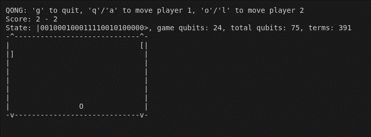

# QONG

This is a small side project which runs a ping-pong-like game via quantum annealing. Specifically we construct a 75-qubit Ising-model Hamiltonian which when optimized gives the next state of the game:



## How it Works

First we set up everything:

 - All game info, the integer positions of the paddles/ball etc. are stored as qubits via a binary encoding
 - An Ising model is constructed that encodes all game logic, containing three types of spins: input, output and ancilla
 - The Ising model looks something like `obj = input1*output2 + ...` then each frame we insert the values for the input spins and anneal the model, from which we extract the values of the output spins
 - The overall Ising model itself never changes and is constructed only once, it's just parameterized via the input qubits
 - Note that this is theoretically an easy model and should have a big gap, since video games are in P

Then the game loop:

1) The players decide whether they want to move their paddle up, down or not at all, via key presses in the terminal
2) We set the input qubits in the Ising model based on the player input and the previous game state
3) The annealer then optimizes the Ising model, finding the minimum energy, and then we set the state based on the final state of the output qubits
4) We draw the new positions of the paddles and ball in the terminal based on the new state, and the game continues until one player wins

## How to Play it

To run it, you just need the latest version of QiliSDK, at least 0.2.2, which at the time of writing is the
main (unreleased) branch of QiliSDK. As in the QiliSDK repo, we recommend using uv to manage the Python environment:

```shell
curl -LsSf https://astral.sh/uv/install.sh | sh
git clone https://github.com/qilimanjaro-tech/qilisdk
git clone https://github.com/qilimanjaro-tech/qong
cd qong
uv venv
source .venv/bin/activate
uv pip install ../qilisdk
```

You now have a virtual environment active with the latest qilisdk, and can run Qong:

```shell
python qong.py
```

By default this will run each anneal using classical simulated annealing, but options are available at the top of the Python script, such as using quantum variational annealing (which actually simulates the quantum system). Since for now we don't offer a 70+ qubit device, this has to be run via simulation.
